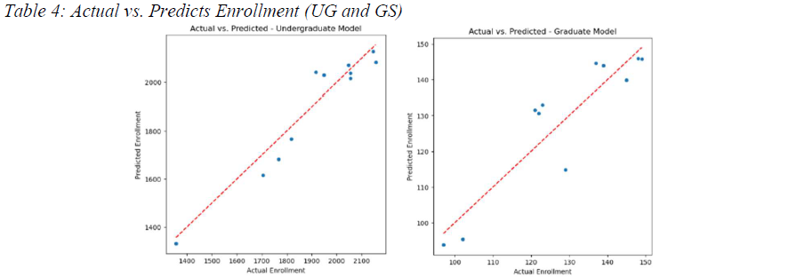
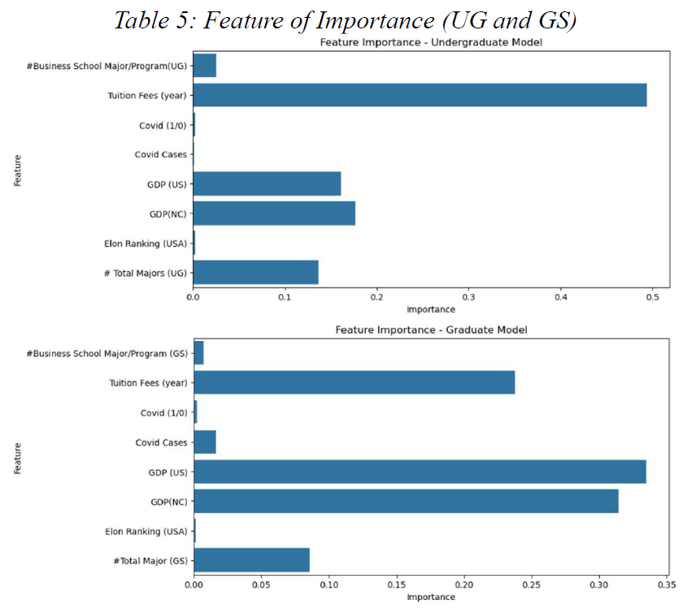
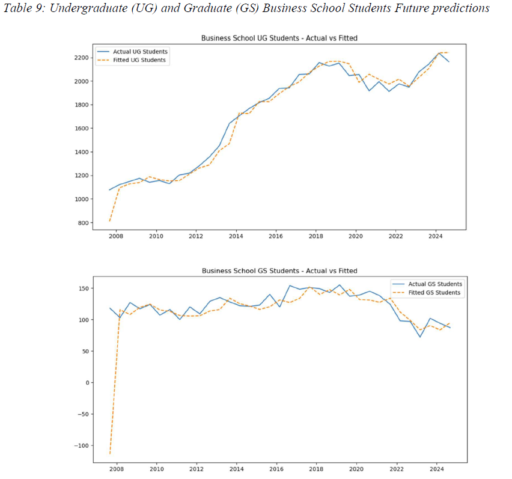

# 🎓 Elon University Enrollment Prediction & Forecasting


## 📌 Project Overview

This capstone project investigates the factors influencing undergraduate and graduate enrollment at **Elon University's Martha and Spencer Love School of Business** and applies predictive analytics to better understand and forecast enrollment trends.

Using historical enrollment data from **2007 to 2024**, the project examines how institutional and economic factors — including tuition, GDP, university rankings, program offerings, and COVID-19 — relate to student enrollment.

Three modeling approaches were explored:

- **Multiple Linear Regression (MLR)**
- **Random Forest Regression**
- **ARIMAX Time-Series Forecasting**

The ultimate goal was to identify the most reliable approach for predicting enrollment and provide insights that could support strategic planning and enrollment decision-making.

---

## 🎯 Business Questions

The project was designed to address several key questions:

- How have undergraduate and graduate enrollment trends changed over time?
- How are tuition and economic conditions associated with enrollment?
- Which factors are most important in predicting business school enrollment?
- How did COVID-19 affect undergraduate and graduate enrollment?
- Which predictive model provides the most accurate enrollment estimates?
- How might enrollment evolve under future economic conditions?

---

## 📊 Dataset

The final dataset contains **35 observations and 17 variables**, combining enrollment, institutional, demographic, and economic information.

Key variables include:

- Undergraduate and graduate enrollment
- Business school enrollment
- Number of undergraduate and graduate programs
- Tuition fees
- North Carolina students
- International students
- U.S. GDP
- North Carolina GDP
- Elon University ranking
- COVID-19 indicators and case counts

Data was compiled from publicly available Elon University sources and supplemented with external economic and COVID-related indicators.

---

## 🧹 Data Preparation

Before modeling, the dataset was cleaned and prepared for analysis.

Key preprocessing steps included:

- Converting tuition values from text/currency format to numeric values
- Converting COVID case counts to numeric format
- Preparing separate feature sets for undergraduate and graduate enrollment
- Creating training and testing datasets for machine learning models
- Evaluating model assumptions and residual behavior

For the machine-learning analysis, the data was divided into **70% training and 30% testing sets**.

---

## 🤖 Modeling Approach

### 1. Multiple Linear Regression

Multiple Linear Regression was used as an interpretable baseline model to examine linear relationships between enrollment and selected predictors.

Model assumptions were evaluated using residual analysis and statistical diagnostics including:

- Durbin-Watson test
- Breusch-Pagan test
- Multicollinearity diagnostics

The model provided useful interpretability but struggled to capture some of the nonlinear relationships in the data, particularly for graduate enrollment.

---

### 2. Random Forest Regression

Random Forest models were developed separately for undergraduate and graduate enrollment.

The model was selected to capture nonlinear relationships and interactions that may not be represented effectively by traditional linear regression.

Feature importance was also analyzed to identify the variables contributing most strongly to enrollment predictions.

---

### 3. ARIMAX Time-Series Forecasting

ARIMAX models were used to examine enrollment as a time series while incorporating external economic variables.

This approach allowed the analysis to consider both:

- Historical enrollment patterns
- External factors such as GDP and COVID-19

Separate ARIMAX models were developed for undergraduate and graduate business school enrollment.

---

## 📈 Model Performance

| Model | Undergraduate R² | Undergraduate MAE | Graduate R² | Graduate MAE |
|------|------:|------:|------:|------:|
| Random Forest | **0.91** | **56.92** | **0.79** | **6.91** |
| Multiple Linear Regression | 0.82 | 81.52 | 0.50 | 10.88 |

Random Forest achieved the strongest predictive performance for both undergraduate and graduate enrollment.

Its ability to capture nonlinear patterns made it particularly effective compared with the linear regression model.

---

## 🔍 Key Findings

### 🌲 Random Forest provided the strongest predictive accuracy

Random Forest outperformed Multiple Linear Regression for both undergraduate and graduate enrollment, achieving an R² of **0.91 for undergraduate enrollment** and **0.79 for graduate enrollment**.

### 💰 Tuition was a major predictor of undergraduate enrollment

Tuition represented the most influential feature in the undergraduate Random Forest model, accounting for approximately **49% of feature importance**.

### 📈 Economic conditions played an important role

U.S. and North Carolina GDP were among the strongest predictors of enrollment, particularly for graduate students.

The models suggested different relationships between economic growth and undergraduate versus graduate enrollment.

### 🎓 Undergraduate and graduate enrollment behave differently

ARIMAX analysis suggested that stronger economic conditions may support undergraduate enrollment while potentially reducing graduate enrollment, possibly because stronger labor markets make immediate employment more attractive than additional education.

### 🦠 COVID-19 effects varied across models

COVID-related variables had relatively low importance in the Random Forest models, while the time-series analysis identified more pronounced short-term effects on enrollment.

---

## 📊 Visualizations

### Random Forest — Actual vs. Predicted Enrollment



### Feature Importance



### Enrollment Forecast



---

## 💡 Business Implications

The results highlight how predictive analytics can support university enrollment planning.

Potential applications include:

- Identifying factors associated with enrollment growth or decline
- Supporting enrollment and capacity planning
- Evaluating the potential impact of tuition changes
- Understanding how economic conditions may affect student behavior
- Anticipating changes in undergraduate and graduate demand

For prediction-focused applications, **Random Forest was the strongest model in this analysis**.

For longer-term forecasting and understanding the effect of external economic variables over time, **ARIMAX provides an additional strategic perspective**.

---

## ⚠️ Limitations & Future Improvements

The primary limitation of this project is the relatively small dataset, consisting of 35 historical observations.

Future analysis could improve model robustness by:

- Expanding the historical dataset
- Incorporating additional demographic and labor-market variables
- Testing additional forecasting methods
- Evaluating Gradient Boosting and XGBoost models
- Using time-series cross-validation for forecasting models
- Incorporating additional institutional and competitor-level data

---

## 🛠️ Technologies Used

- **Python**
- **Pandas**
- **NumPy**
- **Scikit-learn**
- **Statsmodels**
- **Matplotlib**
- **Seaborn**
- **Jupyter Notebook**

---

## 📁 Repository Structure

```text
├── data/
│   └── cleaned_dataset.csv
├── notebooks/
│   ├── mlr_random_forest_combined.ipynb
│   └── arimax_forecasting.ipynb
├── images/
│   ├── Actual vs. Predicted Enrollment.png
│   ├── Business School Students Future predictions.png
│   └── Random Forest Feature Importance.png
├── report/
│   └── capstone_report.pdf
├── requirements.txt
└── README.md
